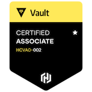
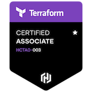

### Hi there 

### I'm Petre (aka fluffeh) a DevOps engineer, homelabber and overall tech enthusiast
---

- 🔭 I’m working towards the <a href="https://learn.microsoft.com/en-us/credentials/certifications/azure-administrator"> Azure AZ-104</a> & <a href="https://learn.microsoft.com/en-us/credentials/certifications/azure-solutions-architect/">Azure AZ-307</a> certifications

- 🎓 I’m on the road to becoming a rustacean 

<!-- Tech stack: -->
- 📜 My certifications:

    
    
    

### 📫 Reach me at:

  <a href="https://matrix.to/#/@fluffeh:matrix.org">
    <picture>
      <source media="(prefers-color-scheme: dark)" srcset="./src/matrix-white.svg">
      <source media="(prefers-color-scheme: light)" srcset="./src/matrix.png">
      
    </picture>
  </a>
  
  

